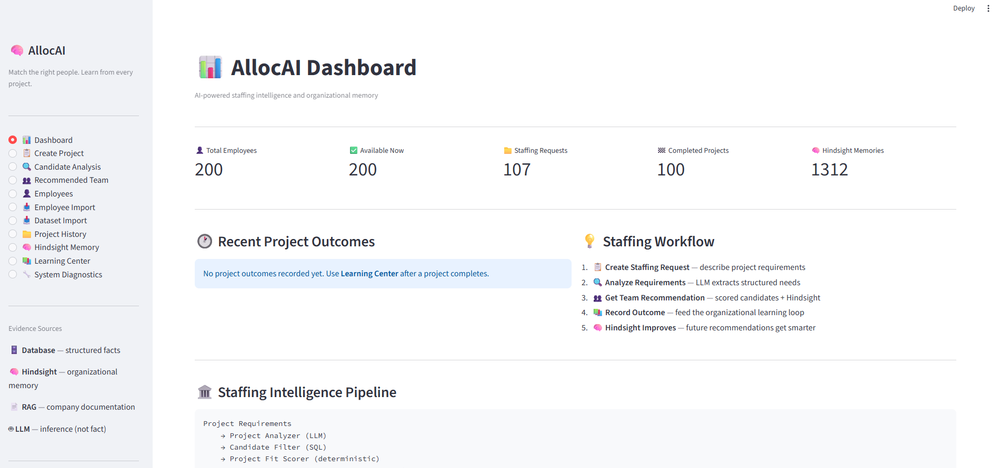
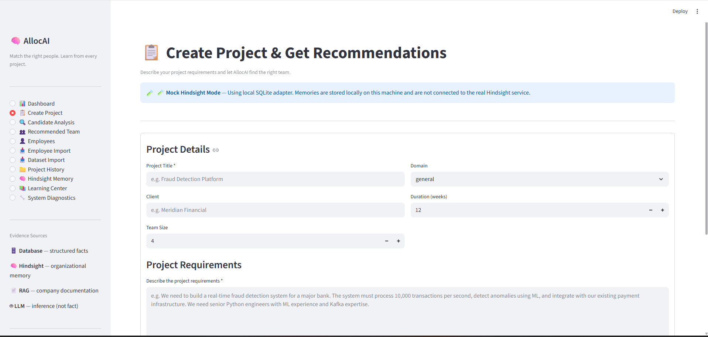
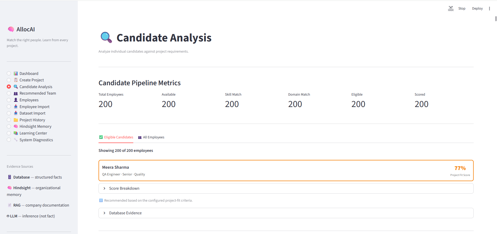
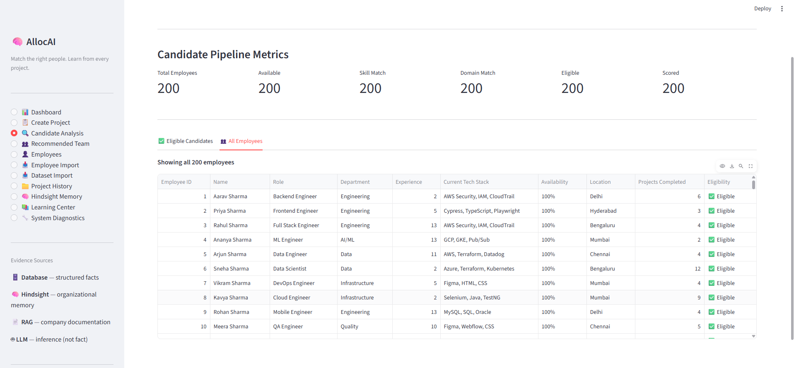
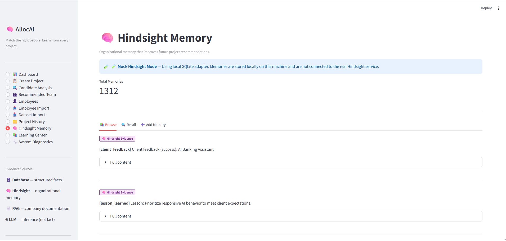

# 🧠 ALLOC
**AI-Powered Project Staffing Intelligence & Organizational Memory**

> *"Match the right people. Learn from every project."*

ALLOC is a Streamlit-based application designed to revolutionize how teams are staffed and how organizational knowledge is retained. It moves beyond traditional project management by explicitly focusing on the **Staffing Request Lifecycle**: extracting requirements, scoring employee fit, composing optimal teams, and capturing lessons learned for future recommendations.

---

## 📸 Screenshots & UI

### 📊 Dashboard
The high-level view of available talent and organizational memory.


### 📋 Staffing Request & Project Details
Extracts technical requirements and skill constraints from natural language descriptions.


### 👥 Candidate Analysis & Recommended Team
The output of the AI constraints engine, maximizing skill coverage and factoring in past lessons.



### 🧠 Hindsight Memory
The learning loop: retaining outcomes and lessons from completed projects.


---

## 🛠️ Concrete Examples

### 1. Requirements Extraction
**User Input:**
> "We need to build an AI chatbot for banking customers. Must use Python, NLP, FastAPI, SQL and AWS. The system should handle 10,000 queries per day and integrate with our core banking APIs."

**LLM Extracted Output:**
- **Domain:** FinTech
- **Required Skills:** `Python`, `NLP`, `FastAPI`, `SQL`, `AWS`
- **Team Size:** `4` (Inferred based on complexity)

### 2. Hindsight Memory (The "Learning Loop")
When a project completes, the system asks the user for outcomes.
**User Outcome:**
> "The NLP pipeline was great, but we struggled with AWS IAM permissions initially. Next time, make sure we have a dedicated DevOps person."

**System Retains (Memory):**
- *Lesson Learned:* "Ensure dedicated DevOps/AWS IAM expertise is present early in FinTech ML projects."
- *Next time a similar project is requested*, the Recommendation Engine surfaces this exact memory as a constraint.

---

## 💡 Honest Lessons Learned During Development

1. **State Management vs. ORM:**
   - **Challenge:** We encountered repeated `sqlalchemy.orm.exc.DetachedInstanceError` crashes in the Streamlit UI. Because Streamlit reruns the script top-to-bottom on every interaction, ORM objects retrieved in one session were being accessed after the session closed.
   - **Solution:** We strictly enforced the boundary between the Data layer and the UI layer. Repositories now map SQLAlchemy ORM models to lightweight `Pydantic` schemas or Dataclasses (like `ProjectSummary`) before returning them to the UI.

2. **LLM Output Determinism:**
   - **Challenge:** Using LLMs (via Groq/Llama-3) to extract structured data (JSON) sometimes resulted in malformed JSON or ignored schema constraints, breaking the pipeline.
   - **Solution:** We implemented a robust `structured_output` wrapper that enforces strict JSON schemas, utilizes a validation loop with up to 2 retries, and falls back to deterministic, safe defaults if the LLM fails completely.

3. **"Active Projects" Misconception:**
   - **Challenge:** Initially, the architecture treated the app as a project tracking tool (with "Active Projects" dashboards). This clouded the product's true purpose.
   - **Solution:** We executed an architectural pivot to remove "Active" states entirely. The app is strictly a **Staffing Intelligence** tool. Projects exist in two states: an active *Staffing Request* (in progress), and a *Completed Project* (for Hindsight extraction). This vastly simplified the mental model and database schema.

4. **Testing in an Agentic Environment:**
   - **Challenge:** Tests running in headless environments would fail due to Streamlit-specific features like `st.cache_resource` being used deep in the domain logic (e.g., `HindsightAdapter`).
   - **Solution:** We decoupled domain logic from Streamlit. We replaced `st.cache_resource` with Python's native `functools.lru_cache` in the backend services, ensuring the business logic remains pure and testable outside of a Streamlit context.

---

## 🚀 Quick Start

1. **Clone & Setup:**
```bash
git clone https://github.com/bogulachaitanya/AllocAI.git
cd AllocAI
python -m venv .venv
.venv\Scripts\activate
pip install -r requirements.txt
```

2. **Environment Variables:**
Create a `.env` file from the example:
```bash
cp .env.example .env
# Add your GROQ_API_KEY
```

3. **Run the App:**
```bash
streamlit run app.py
```